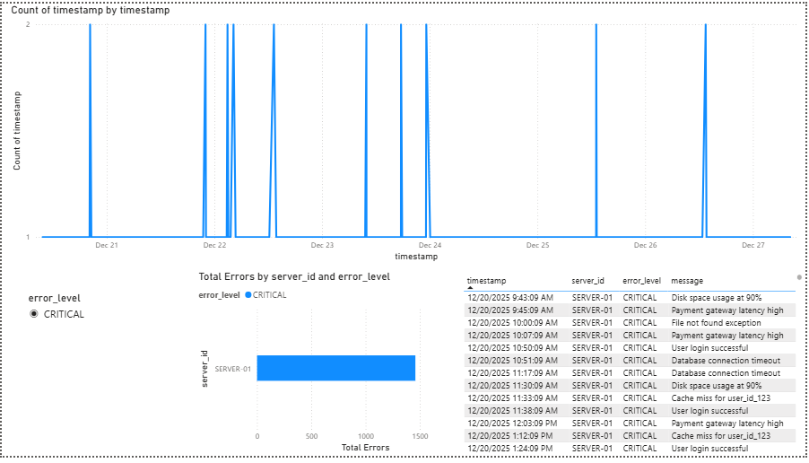

# 🛡️ LogAnalyzer: Cybersecurity Audit & Threat Detection

### *Automated system for parsing server logs, detecting security anomalies, and visualizing threat patterns.*

---

## 📖 Overview
**LogAnalyzer** is a security-focused automation tool designed to process raw server logs and identify potential vulnerabilities. It automates the extraction of critical data points from unstructured logs, performs data cleaning, and facilitates security auditing through automated reporting and visualization.

---

## 📊 Security Dashboard
<p align="center">
  
</p>

---

## 📂 Project Structure
Based on the codebase:

```text
LogAnalyzer/
├── 📄 server_logs.txt         # Raw server logs (Source)
├── 📄 logs_parser.py          # Script for Regex-based parsing and extraction
├── 📄 db_to_csv.py            # Converts processed database logs to CSV for analytics
├── 📄 logs_warehouse.db       # SQLite database for structured log storage
├── 📊 LogAnalyzer_Visual.pbix # Power BI Dashboard for threat visualization
├── 📄 server_logs_clean.csv   # Final cleaned dataset for reporting
└── 📄 README.md               # Project documentation

🚀 Key Features

* Automated Log Parsing: Uses regex to extract IP addresses and status codes.
* Structured Storage: Migrates logs into a relational SQLite database.
* Data Transformation: Automates CSV exports for seamless reporting.
* Threat Detection: Identifies suspicious patterns like unauthorized access.

🛠️ Tech Stack

* Language: Python 3.9+ (Regex, SQLite3, Pandas)
* Database: SQLite
* Visualization: Microsoft Power BI
* Version Control: Git & GitHub

⚙️ Setup & Installation

1. Clone the repository:
   git clone https://github.com/darshana-gathibandhe19/LogAnalyzer.git

2. Run the parser to process raw logs:
   python logs_parser.py

3. Export data for visualization:
   python db_to_csv.py

4. Open 'LogAnalyzer_Visual.pbix' in Power BI Desktop to view the report.

🔮 Future Enhancements

* Real-time Alerting: Integration with Slack/Email APIs for notifications.
* Geo-IP Mapping: Automatically mapping source IPs to physical locations.
* Machine Learning: Implementing clustering to detect stealth attacks.